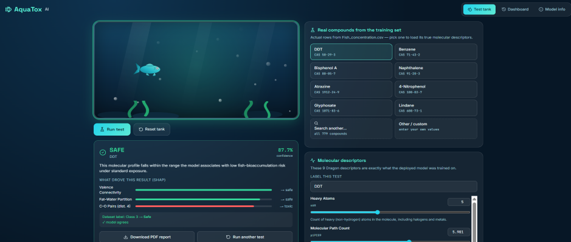
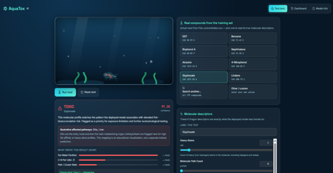
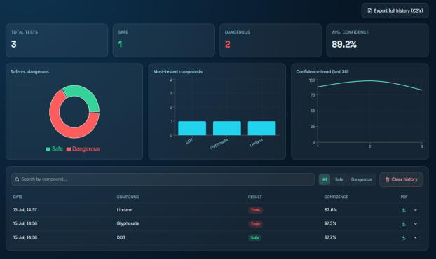
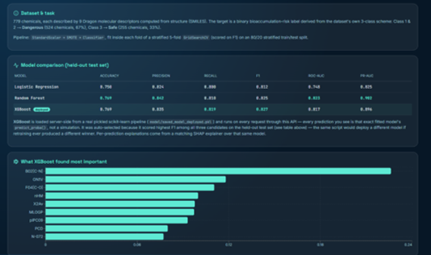

# Predicting Chemical Bioconcentration in Fish Using Machine Learning

**MSc Data Science Final Project**

Predicts whether a chemical is likely to **bioaccumulate to dangerous levels in fish**, using only its molecular structure — as a fast, low-cost, animal-free screening step ahead of real laboratory bioconcentration factor (BCF) testing.

---

## Table of Contents
- [Research Question](#research-question)
- [Why This Matters](#why-this-matters)
- [Repository Structure](#repository-structure)
- [Dataset](#dataset)
- [Methodology](#methodology)
- [Results](#results)
- [AquaTox AI — Interactive Dashboard](#aquatox-ai--interactive-dashboard)
- [How to Run the Dashboard](#how-to-run-the-dashboard)
- [API Reference](#api-reference)
- [Design Notes / Honest Trade-offs](#design-notes--honest-trade-offs)
- [Ethics](#ethics)
- [References](#references)

---

## Research Question

> Using the QSAR fish bioconcentration dataset, which machine learning model performs best based on F1-score for detecting potentially hazardous chemicals? Furthermore, how do Logistic Regression, Random Forest, and XGBoost differ when weighing the trade-off between catching truly dangerous compounds (recall) and avoiding false alarms (precision)?

---

## Why This Matters

- Real BCF testing costs **€35,000+ per chemical** and requires **100+ live fish**
- Machine learning on molecular descriptors offers a cheap, **animal-free** screening alternative — supporting the **3Rs principle** (Replacement, Reduction, Refinement)
- A fast, accurate classifier could flag hazardous chemicals early, before committing to expensive lab testing

---

## Repository Structure

```
Final-Project_Predicting-Chemical-Bioconcentration-in-Fish-Using-Machine-Learning/
├── README.md
├── requirements.txt
├── dataset/
│   └── Fish_concentration.csv          # QSAR Bioconcentration Classes dataset (779 chemicals)
├── notebook/
│   └── Fish_Bioconcentration_Prediction.ipynb   # Full EDA, pre-processing, modelling, evaluation
├── presentation/
│   └── Fish_Bioconcentration_ML_Presentation.pptx
└── dashboard/                           # AquaTox AI — interactive web app
    ├── model/
    │   ├── train.py                     # Reproduces the notebook pipeline, saves all artifacts
    │   ├── saved_model_deployed.pkl     # Whichever model scored highest F1 — auto-selected
    │   ├── saved_model_rf.pkl           # Comparison copy (generated by train.py)
    │   ├── saved_model_lr.pkl           # Comparison copy (generated by train.py)
    │   ├── saved_model_xgb.pkl          # Comparison copy (generated by train.py)
    │   ├── scaler.pkl
    │   └── model_metadata.json          # Metrics, feature importances, dataset stats for all 3 models
    ├── backend/                         # FastAPI
    │   ├── app.py
    │   ├── schemas.py
    │   ├── database/                    # SQLAlchemy + SQLite (history.db, gitignored)
    │   ├── routes/                      # predict, history, stats, compounds, model-info, report
    │   └── services/                    # ml_service.py (loads model, runs SHAP), report_service.py (PDF/CSV)
    └── frontend/                        # React + Vite + Tailwind
        └── src/
            ├── App.jsx
            ├── api.js
            ├── pages/                   # TestPage, Dashboard, ModelInfo
            ├── components/              # TankScene, FishSVG, ControlPanel, ResultPanel
            └── data/featureMeta.js
```

---

## Dataset

**QSAR Bioconcentration Classes Dataset** — UCI Machine Learning Repository
DOI: [10.24432/C56S46](https://doi.org/10.24432/C56S46) · Compiled by Grisoni et al. (Univ. Milano-Bicocca)

| | |
|---|---|
| Chemicals | 779 |
| Molecular descriptors | 9 (continuous) |
| Target | 3-class bioconcentration category → collapsed to binary **Dangerous / Safe** |
| Missing values | 0 |
| Class balance | 67.3% Dangerous, 32.7% Safe |

**The 9 molecular descriptors:**

| Descriptor | Meaning |
|---|---|
| `nHM` | Number of heavy atoms |
| `piPC09` | Molecular path count |
| `PCD` | Path / cluster ratio |
| `X2Av` | Average valence connectivity |
| `MLOGP` | Fat–water partition coefficient (most discriminating feature) |
| `ON1V` | Overall valence index |
| `N-072` | Nitrogen-fragment count |
| `B02[C-N]` | Carbon–nitrogen pair at topological distance 2 |
| `F04[C-O]` | Carbon–oxygen pairs at topological distance 4 |

**Binary target definition:** `is_dangerous = 1` if original Class ∈ {1, 2}, else `0` (Class 3 = Safe).

---

## Methodology

### 1. Data inspection & cleaning
- Checked shape, dtypes, and missing values → **0 missing values**, no imputation needed
- Outlier check via the **IQR method** on all 9 descriptors → very few outliers found; kept deliberately, since they represent real chemicals (e.g. extreme MLOGP values), not data errors

### 2. Exploratory Data Analysis
- Class distribution → confirmed **imbalance** (67% Dangerous vs 33% Safe), which is why **F1-score**, not raw accuracy, is used as the main evaluation metric
- Correlation heatmap → only one strong pair (`piPC09` ↔ `PCD`, r = 0.74); all 9 features kept (no multicollinearity issue)
- Box plots / violin plots by class → `MLOGP` shows the clearest separation between Safe and Dangerous chemicals
- Scatter plot (`MLOGP` vs `nHM`) → dangerous chemicals cluster where both are high, suggesting a simple baseline rule (`MLOGP > 3.5 AND nHM > 12`) used as a sanity-check comparison point
- Histograms → features have very different ranges → **scaling required** before modelling

### 3. Train/test split
- **Stratified 80/20 split** → 623 training / 156 test chemicals, same Safe:Dangerous ratio preserved in both sets
- Test set only touched once, at final evaluation

### 4. Leak-free modelling pipeline

All three models share **one fair procedure**, built as an `imblearn` pipeline:

```python
pipe = ImbPipeline([
    ('scaler', StandardScaler()),   # zero mean, unit variance
    ('smote',  SMOTE()),            # balances classes — training folds only
    ('clf',    classifier)
])

cv = StratifiedKFold(n_splits=5, shuffle=True, random_state=42)
search = GridSearchCV(pipe, param_grid, scoring='f1', cv=cv)
search.fit(X_train, y_train)
```

Because `StandardScaler` and `SMOTE` live **inside** the pipeline, they are refit independently within every cross-validation fold — so the test set (and even the held-out fold in CV) is never used to influence scaling or balancing. **Zero data leakage.**

### 5. Models & hyperparameter grids (GridSearchCV, 5-fold, scored on F1)

| Model | What it does | Tuned hyperparameters |
|---|---|---|
| **Logistic Regression** | Draws a linear decision boundary; fully interpretable via odds ratios | `C` ∈ {0.01, 0.1, 1, 10}, `penalty` ∈ {L1, L2} |
| **Random Forest** | Ensemble of decision trees voting on the outcome | `n_estimators` ∈ {200, 400}, `max_depth` ∈ {None, 10, 20}, `min_samples_leaf` ∈ {1, 2, 4}, `max_features` = sqrt |
| **XGBoost** | Sequential boosted trees, each correcting the previous one's errors | `n_estimators` ∈ {200, 400}, `max_depth` ∈ {3, 5}, `learning_rate` ∈ {0.05, 0.1}, `subsample` ∈ {0.8, 1.0}, `colsample_bytree` ∈ {0.8, 1.0} |

### 6. Evaluation
- Confusion matrix, Accuracy, Precision, Recall, F1-score, ROC-AUC, PR-AUC — all computed on the untouched 20% test set
- Permutation feature importance (Random Forest) and coefficient/odds-ratio analysis (Logistic Regression) for interpretability
- Precision/Recall/F1 vs. decision-threshold analysis (XGBoost) — explores lowering the default 0.50 cut-off to trade a little precision for higher recall, since missing a dangerous chemical is costlier than a false alarm in a regulatory screening context

---

## Results

| Model | Precision | Recall | F1-score | ROC-AUC | Verdict |
|---|---|---|---|---|---|
| Logistic Regression | 0.82 | 0.80 | 0.81 | 0.75 | Interpretable baseline |
| Random Forest | 0.84 | 0.81 | 0.83 | **0.82** | Strong all-rounder, best risk ranking |
| **XGBoost** | **0.84** | **0.82** | **0.83** | 0.82 | **Best F1 — winning model** |

**Answer to the research question:** XGBoost achieves the best F1-score, with the strongest combined precision and recall. Random Forest is a very close second and has the best ROC-AUC, making it the best choice if the goal is *ranking* chemicals by risk rather than a hard yes/no cut-off. Logistic Regression trails both, but remains valuable as a transparent, easily explainable baseline for non-technical stakeholders.

**Practical recommendation:** deploy XGBoost for hazard flagging, keep Random Forest as an interpretable-ranking backup, and consider lowering XGBoost's decision threshold below 0.50 in deployment — since in chemical safety screening, missing a dangerous chemical (false negative) is far more costly than a false alarm.

---

## AquaTox AI — Interactive Dashboard

A full-stack web application built on top of the trained model, so the analysis isn't just notebook results — it's a usable screening tool.

**What it does:**
- Enter a chemical's 9 molecular descriptors (or pick a real compound from the dataset) and get an instant **Safe / Dangerous** prediction with a confidence score
- Shows the top factors that drove each prediction (SHAP-based explanation)
- Aquarium-themed visual: a fish reacts live to the prediction (swims happily if Safe; shows a toxic-absorption → skeletal X-ray sequence if Dangerous)
- Dashboard tab: total tests run, Safe/Dangerous split, most-tested compounds, confidence trend
- Full test history with search/filter, downloadable PDF report per test, CSV export of all history
- The deployed model is **chosen automatically, not hardcoded** — `model/train.py` trains all three candidates and deploys whichever scores highest F1 on the held-out test set. If you retrain and a different model wins, it gets deployed instead, and every part of the app (API, PDF reports, dashboard) picks up the new name and its own feature-importance ranking automatically. Check the **Model info** tab or `model_metadata.json` to see which one is currently live.

**Screenshots:**

| Prediction — Safe | Prediction — Dangerous |
|---|---|
|  |  |

| Dashboard overview | Model comparison |
|---|---|
|  |  |

| Test history | PDF report |
|---|---|
|  |  |

*(Drop your own screenshots into `dashboard/screenshots/` using these filenames, or edit the paths above to match whatever you save. Even 2–3 screenshots — a Safe result, a Dangerous result, and the Dashboard overview — cover the essentials.)*

**What's illustrative, not modelled:** the organ/skeleton visualization isn't a second trained model. The binary Safe/Dangerous prediction is real; which organs light up (gills, liver, kidneys, heart) follows a simple, clearly-labelled rule based on the input profile, for educational value.

**Tech stack:**

| Layer | Tools |
|---|---|
| Frontend | React, Vite, Tailwind CSS, React Router, Recharts, Lucide icons |
| Backend | FastAPI (Python), scikit-learn / XGBoost (the actual trained model), SHAP (explanations) |
| Storage | SQLite (test history) |
| Reports | ReportLab (PDF generation) |
| Fish animation | Hand-coded SVG + CSS (no external images, no 3D engine) |

Every prediction shown in the app is computed live by the real trained model loaded server-side — not mocked or hardcoded.

---

## How to Run the Dashboard

**1. Train the model** (a trained model is already included, so this step is optional)
```bash
cd dashboard
pip install -r requirements.txt
python model/train.py
```
This runs the full `GridSearchCV` for Logistic Regression, Random Forest, and XGBoost (a minute or two), then writes `saved_model_deployed.pkl` (whichever model won), plus comparison copies of all three, `scaler.pkl`, and `model_metadata.json` into `model/`. `xgboost` is optional — if it isn't installed, training still completes with LR + RF and deploys whichever scores higher F1.

**2. Start the backend**
```bash
python -m uvicorn backend.app:app --reload --port 8000
```
API docs (Swagger UI): http://localhost:8000/docs
A SQLite database is created automatically at `backend/database/history.db`.

**3. Start the frontend** (in a second terminal)
```bash
cd frontend
npm install
npm run dev
```
Open the printed local URL (typically `http://localhost:5173`) — the Vite dev server proxies `/api/*` to the backend on port 8000.

For a production build:
```bash
npm run build      # outputs frontend/dist
npm run preview    # serve the production build locally
```

---

## API Reference

| Method | Path | Description |
|--------|------|--------------|
| GET | `/api/health` | Backend + model status |
| GET | `/api/compounds/presets` | 8 curated real compounds |
| GET | `/api/compounds/search?q=` | Search all 779 training compounds by CAS/SMILES |
| POST | `/api/predict` | Run a prediction, stores it in history |
| GET | `/api/history` | All stored predictions |
| DELETE | `/api/history` | Clear all history |
| DELETE | `/api/history/{id}` | Delete one record |
| GET | `/api/stats` | Dashboard aggregates (counts, charts) |
| GET | `/api/model-info` | Metrics for all 3 models, feature importances |
| GET | `/api/report/{id}` | Download a single-test PDF report |
| GET | `/api/report/history/csv` | Export full history as CSV |

---

## Design Notes / Honest Trade-offs

- **The deployed model is chosen automatically, not hardcoded**, because a real Python backend can load whatever pickled model wins directly — no need to hand-port tree logic into JavaScript the way a browser-only demo would. All three candidates' test-set metrics live in `model_metadata.json` and are shown side-by-side in the **Model info** tab, with the winner clearly tagged `deployed`.
- **Tailwind is wired up** (see `tailwind.config.js`) but most of the aquarium visual system — the tank, bubbles, fish animation, skeleton reveal — is hand-written CSS in `src/index.css`, since fine-grained keyframe animation isn't a good fit for utility classes.
- **Recharts** is used in place of Chart.js — it's the React-idiomatic equivalent and avoids manual canvas lifecycle management inside React.
- **Three.js was intentionally left out.** A hand-tuned SVG/CSS fish gives more reliable, controllable results (exact skeleton-only-on-death behaviour, predictable performance) than a WebGL scene for this scope.
- **The 8 quick-pick compounds and the "search another compound" feature are real rows from the training CSV** (DDT, Benzene, Bisphenol A, Naphthalene, Atrazine, 4-Nitrophenol, Glyphosate, Lindane, plus all 779 rows searchable by CAS number). Where a compound's true dataset label is known, the UI shows it next to the model's prediction so you can see where the model agrees or disagrees — the model is ~80–84% accurate, not perfect, and the app is honest about that.

---

## Ethics

- No personal or human data — purely chemical / molecular descriptor data
- Public, open-access source (UCI Machine Learning Repository)
- Non-identifiable, non-sensitive information throughout
- Supports the **3Rs principle**: reusing existing BCF data reduces the need for new animal testing

---

## References

1. Grisoni, F., Consonni, V., Vighi, M., Villa, S. and Todeschini, R. (2016) 'Investigating the mechanisms of bioconcentration through QSAR classification trees', *Environment International*, 88, pp. 198–205. https://doi.org/10.1016/j.envint.2015.12.024
2. Kobayashi, Y. and Yoshida, K. (2021) 'Development of QSAR models for prediction of fish bioconcentration factors using physicochemical properties and molecular descriptors with machine learning algorithms', *Ecological Informatics*, 63, 101285. https://doi.org/10.1016/j.ecoinf.2021.101285
3. Pore, S., Pelloux, A., Chatterjee, M., Banerjee, A. and Roy, K. (2024) 'Machine learning-based q-RASAR predictions of the bioconcentration factor of organic molecules estimated following the OECD guideline 305', *Journal of Hazardous Materials*, 479, 135725. https://doi.org/10.1016/j.jhazmat.2024.135725

---

*Educational / academic project. Not a substitute for regulatory ecotoxicological assessment.*
